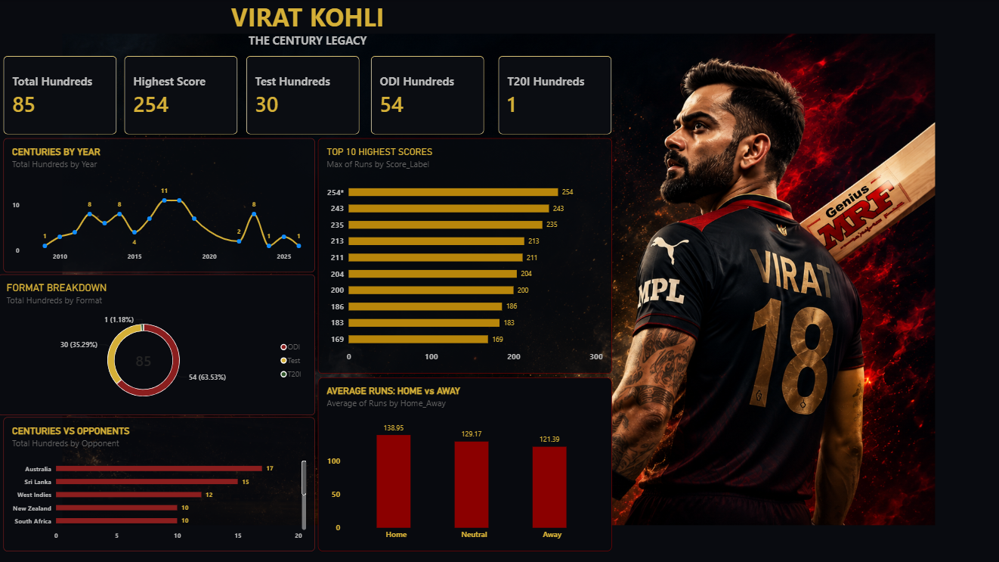

🏏 Virat Kohli — Century Legacy Dashboard

An interactive Power BI cricket analytics dashboard built to analyze Virat Kohli's international batting performance across Test, ODI and T20I cricket.

The dashboard transforms match-level raw data into an insight-driven visual story covering centuries, highest scores, yearly performance, opponent-wise performance and home/away scoring patterns.

📊 Key Performance Metrics
| Metric                          |  Result |
| ------------------------------- | ------: |
| 🏏 Total International Hundreds |  **85** |
| 🔥 Highest Score                | **254** |
| 🟥 Test Hundreds                |  **30** |
| 🟡 ODI Hundreds                 |  **54** |
| 🟢 T20I Hundreds                |   **1** |
---
🔎 Key Insights
85 total international centuries demonstrate Kohli's long-term consistency across formats.
254 is the highest individual score captured in the dataset.
ODI cricket contributes the largest share of centuries — 54, making it the strongest format in terms of century production.
Test cricket contributes 30 centuries, highlighting sustained performance in the longest format.
The Centuries by Year analysis highlights periods of peak scoring and changes in performance over time.
Opponent-wise analysis identifies the teams against whom Kohli has produced the highest number of centuries.
Top 10 Highest Scores highlights his most impactful individual innings.
Home vs Neutral vs Away analysis compares average runs across different playing conditions.
---
.
🎯 Project Objective

The objective of this project is to convert raw cricket statistics into a clear, interactive and insight-driven dashboard that answers questions such as:

How has Virat Kohli's century production changed over the years?
Which format has contributed the most centuries?
Which opponents has he performed best against?
What are his highest individual scores?
How does his average scoring differ between Home, Neutral and Away conditions?
---
🛠️ Tools & Technologies
Power BI — Dashboard development & data visualization
Power Query — Data cleaning and transformation
DAX — Measures and calculated metrics
Microsoft Excel — Raw data preparation
GitHub — Project documentation and version control
---
📈 Dashboard Components
KPI Cards
Total Hundreds
Highest Score
Test Hundreds
ODI Hundreds
T20I Hundreds
---
Visual Analysis
Centuries by Year
Format Breakdown
Top 10 Highest Scores
Centuries vs Opponents
Average Runs: Home vs Away/Neutral
---
💡 Business-Style Analytical Thinking

Instead of presenting cricket statistics as a simple data table, this project focuses on decision-oriented insights:

Metric → Comparison → Pattern → Insight

For example:

85 Centuries → Format Breakdown → ODI leads with 54 → ODI is the strongest century-producing format in the dataset.

This approach demonstrates how raw data can be transformed into meaningful performance insights, rather than simply displaying numbers.
---

📸 Dashboard Preview

---
🚀 Skills Demonstrated
Data Cleaning
Data Transformation
Data Modeling
DAX Measures
KPI Development
Interactive Data Visualization
Performance Analysis
Trend Analysis
Comparative Analysis
Dashboard UI/UX
Insight-driven Storytelling
---
## 🔗 Project Links

- 📊 **GitHub Repository:** [Virat Kohli Century Legacy Dashboard](YOUR_GITHUB_REPO_LINK)
- 📁 **Raw Data:** [Virat Kohli Hundreds Raw Data](sandbox:/mnt/data/Virat_Kohli_Hundreds_Raw_Data(4).xlsx)
- 💼 **LinkedIn:** [Rahul Raigar](https://www.linkedin.com/in/rahul-raigar-data3293/)
👤 Author

Rahul Raigar
Data Analyst | Power BI | SQL | Excel | Python
